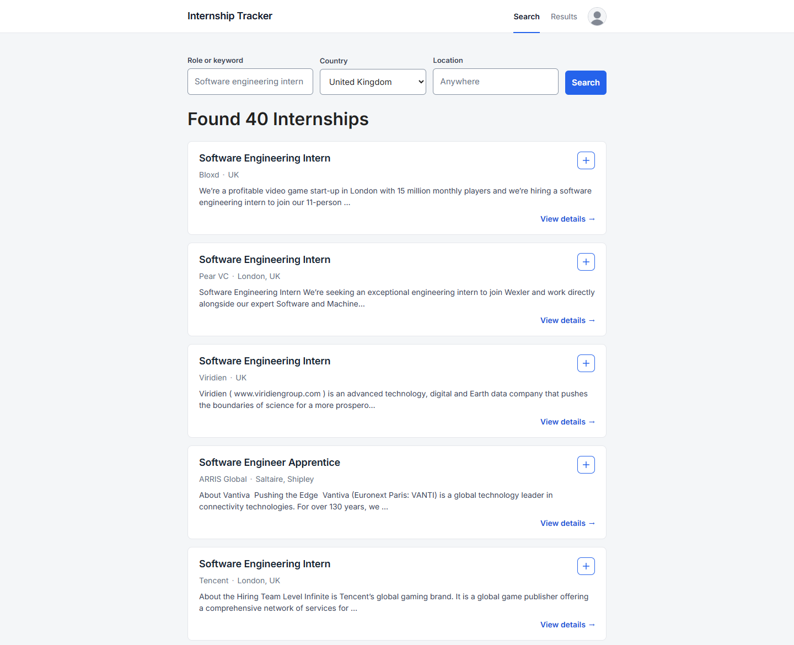
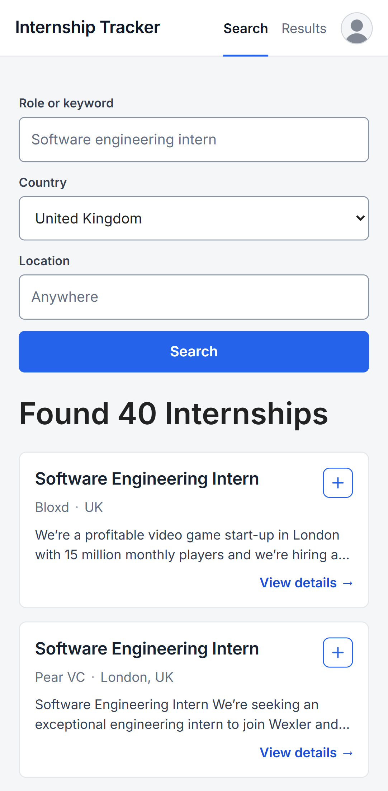
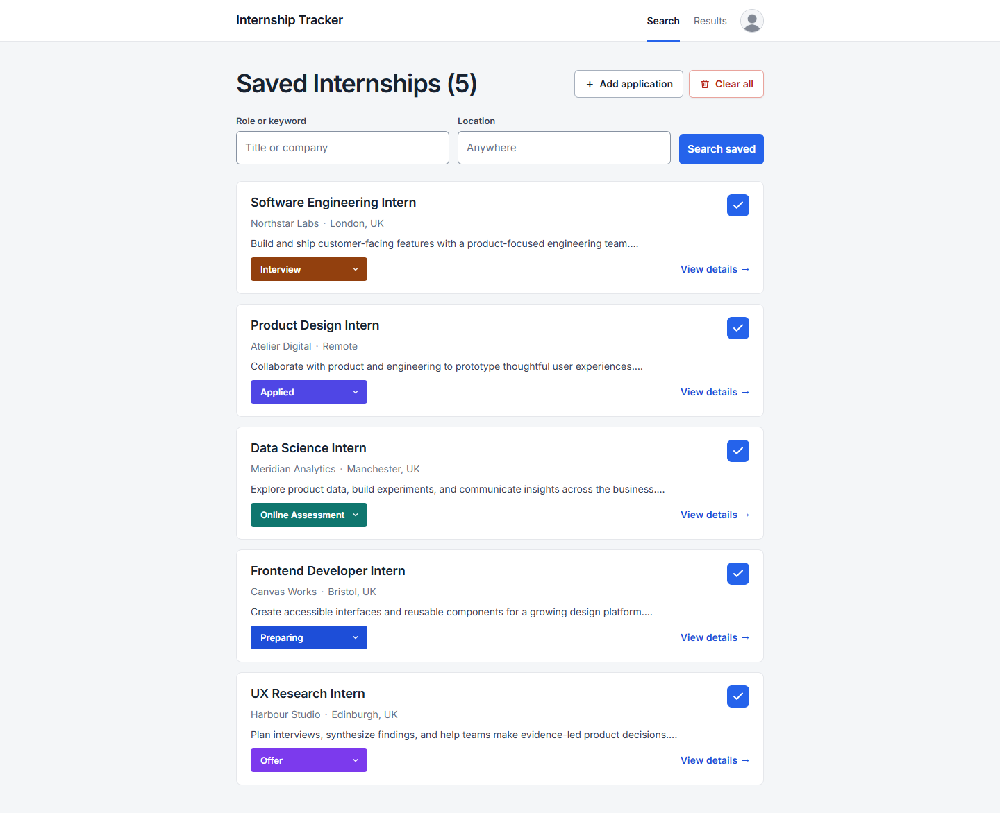
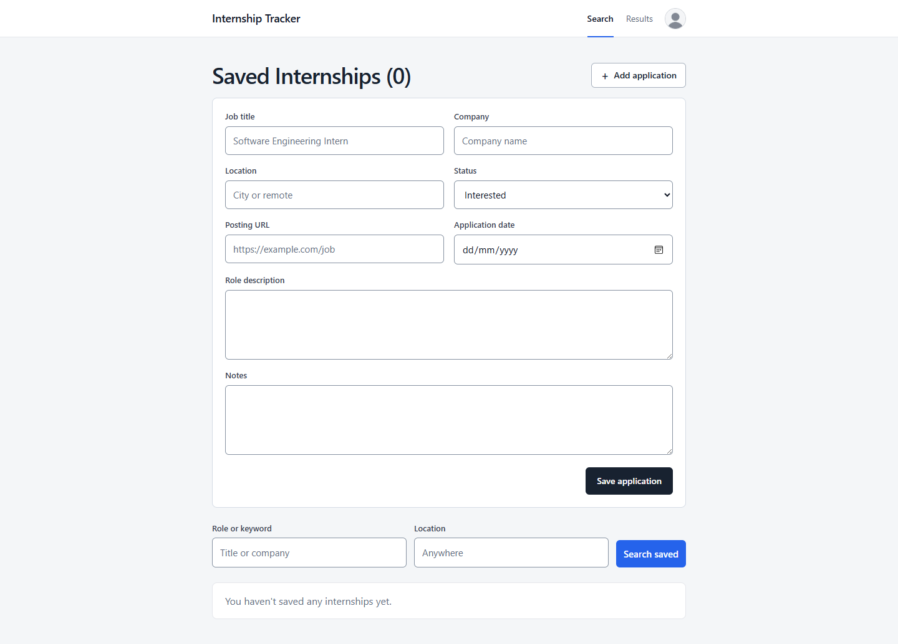
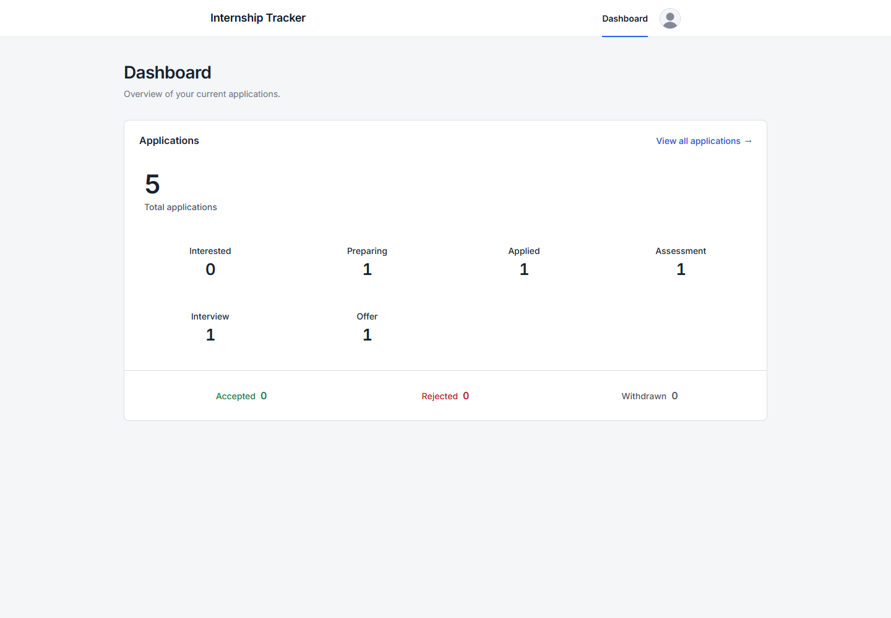

# Internship Tracker

A small web application for finding internships and tracking applications in one place. Internship listings are retrieved from Adzuna, while saved applications and their progress are stored locally in the browser.

## Screenshots

### Internship search



### Mobile search



### Saved applications



### Add an application manually



### Application dashboard



## Features

- Search for internships by keyword, country, and location.
- Save internship listings for later.
- Add applications manually.
- Track each application from Interested through Accepted, Rejected, or Withdrawn.
- Add an application date and private notes.
- View application totals and status counts on the dashboard.
- Search and paginate saved applications.
- Responsive, keyboard-accessible interface.

## Getting started

### Requirements

- Node.js 22.13 or later
- An [Adzuna developer account](https://developer.adzuna.com/)

### Installation

1. Install the dependencies:

   ```bash
   npm install
   ```

2. Copy `.env.example` to `.env` and add your Adzuna credentials:

   ```env
   APP_ID=your_app_id
   APP_KEY=your_app_key
   ```

3. Start the application:

   ```bash
   npm start
   ```

4. Open `http://localhost:3000` in your browser.

## Testing

Run the syntax, behavior, server, and accessibility tests with:

```bash
npm test
```

## Built with

- HTML, CSS, and JavaScript
- Node.js and Express
- Adzuna Jobs API
- localStorage
- Node test runner, jsdom, and axe-core
